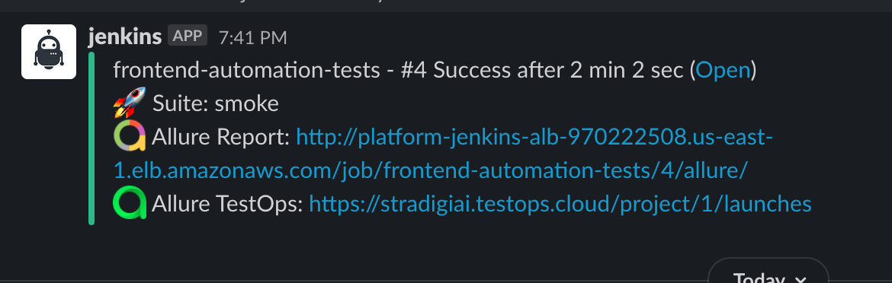

# Automation project

#### Frameworks

[Kotlin](https://kotlinlang.org/docs/reference/) - Programming language based on JVM and fully compatible with Java!

[JUnit5](https://junit.org/junit5/docs/current/user-guide/) - Programmer-friendly testing framework for Java and the JVM.

[Feign](https://github.com/OpenFeign/feign) - Feign is a Java to HTTP client binder inspired by Retrofit, JAXRS-2.0, and WebSocket.

[Kotest](https://github.com/kotest/kotest) - Kotest is a flexible and elegant multi-platform test framework for Kotlin with extensive assertions and integrated property testing.

# Report

[Allure](https://docs.qameta.io/allure/) - A flexible lightweight multi-language test report tool.

[Allure TestOps](https://qameta.io/) - Next-gen Software Quality Management Platform brings together automated and manual testing.

#### The most popular annotation:

`@Step` - combine all steps (annotated methods) and generate a readable test report where you will see all the steps as text. Also, it adds variables with values to the step into the report.

`@DisplayName` - just JUnit 5 annotation witch means a test name

`@Issue` - add a link to Jira (or any other system) into your report for the test

`@TmsLink` - add a link to TestRail (or any other system) into your report for the test

`@Severity` - add a marker as BLOCKER or CRITICAL and etc into your report for the test

`@Flaky` - add a marker the test as flaky in the report system

`@Epic` -> `@Feature` -> `@Story` - combine your tests to a tree and split them by epic | feature | story


# How to run

### Before start

You need to install `JDK 11` and `Allure Report`

#### Notes

1. Those tests where split by `TAGS` (annotation above test classes) and you need to check this before if you want to run only one group.
2. If you want to run a few test classes please be sure you have free nodes for UI because all tests work in `PARALLEL` mode by class

#### Parameters

`-D ENV_NAME` - the name of Environment (dev-aws, qa-azure, qa-aws, uat-aws, prod-azure, prod-aws). Default value - qa-aws. Each env has own property file in main/resources/env_configs.

`-D TAGS` - Test suites which you want to run

### Start

`Jenkins` Run tests using [Jenkins](http://platform-jenkins-alb-970222508.us-east-1.elb.amazonaws.com/view/automation/)

`Local` Run only one test group/tag:

```bash
$ ./gradlew clean test -D TAGS=<tag name> -D ENV_NAME=<env>
```

`Local` Run all tests (UI and BACK):

```bash
$ ./gradlew clean test
```

### After tests (local only)

If you want to see the test report locally:
```bash
$ allure serve build/allure-results
```
or
```bash
$ allure serve build/allure-results --host localhost --port 9999
```

If you want just generate the test report without web service run:
```bash
$ allure generate build/allure-results
```
Go to `src/allure-report` folder and click `index.html`

#### CI

If you use [Jenkins](http://platform-jenkins-alb-970222508.us-east-1.elb.amazonaws.com/view/automation/) then the report will be generated automatically after a run and connected to the job. You will need just click on the Allure logo

#### Slack

You will see this notification with links on reports in the [#jenkins-e2e](https://stradigiai.slack.com/archives/C01KJ2VV9N0) Slack channel if run tests using Jenkins.


### Allure + Grafana

**Allure** generates a report specially for **Grafana** and **Prometheus**

**Grafana**:
- Generate **allure-report** by `$ allure generate allure-results`
- Install **InfluxDB** (use **Docker**)
- Get a file for **InfluxDB** in `/allure-report/export/influxDbData.txt`
- Install **Grafana** (use **Docker**)
- Integrate **InfluxDB** to **Grafana**
- Send the report to **InfluxDB** by
- `$ curl -XPOST 'http://<host>/write?db=<db name>' --data-binary @allure-report/export/influxDbData.txt`
- Check **Grafana**
- ***PROFIT***
